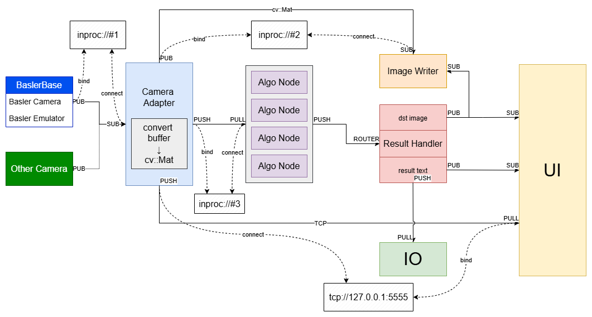

# High Performance Machine Vision Architecture



## How to Build

In administrative cmd:
```bash
set_local_vars.bat
mkdir build && cd build
cmake ..
cmake --build . --config release
```
### Build Options

| Features     | Options                 |
| -------- | -------------------- |
| Disable Timer | VERT_DISABLE_TIMING |
| Image Window for Debug | VERT_DEBUG_WINDOW  |
| Enable Testing | VERT_ENABLE_TEST |


## How to Install

In powershell prompt:
```powershell
cd build
cmake --install .
```

## How to Pack

use CPack
TODO:

## How to Run

In powershell prompt:
```powershell
cd CMAKE_INSTALL_PREFIX
./VERT.exe -c <init.yaml>
```
> The default install directory is C:/VisionEdgeRT/bin

### Run Options

| Features     | Options                 |
| -------- | -------------------- |
| specify init yaml | -c,--config <init.yaml> |